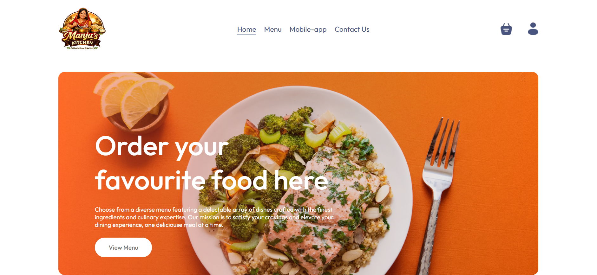
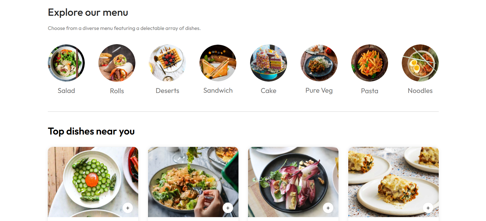
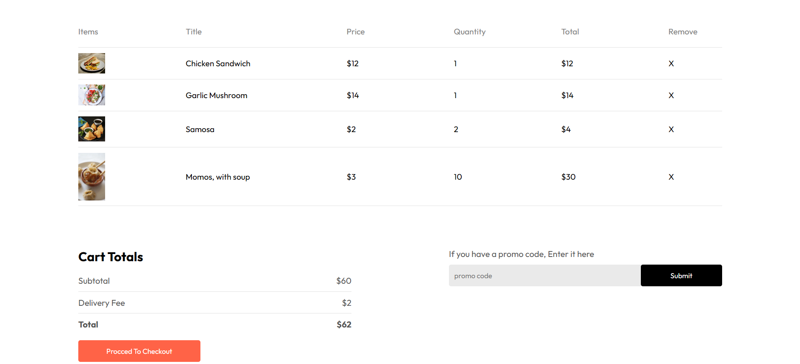
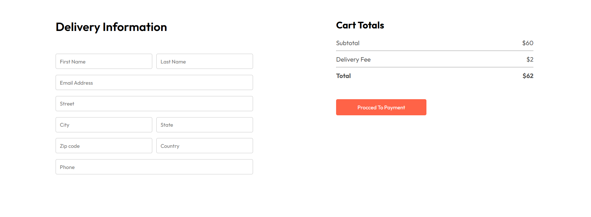
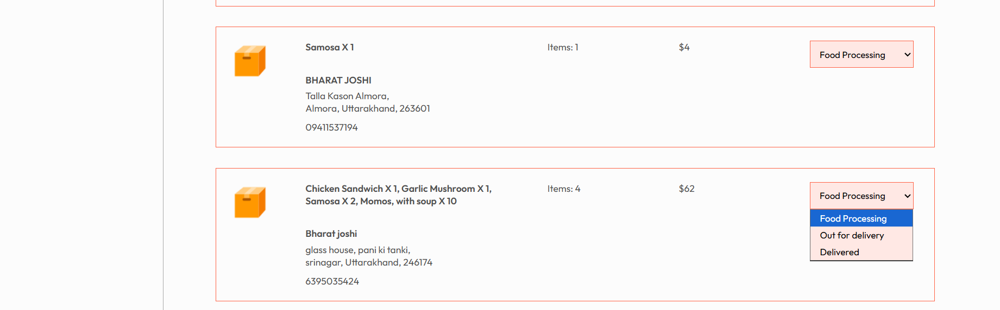

# 🍔 Food Ordering Website – Full Stack MERN Project

A fully functional **end-to-end Food Ordering Web Application** built using the **MERN stack (MongoDB, Express.js, React.js, Node.js)**.  
This project simulates a real-world online food ordering platform where users can browse food items, place orders, make payments, and track order status, while admins can manage food items and user orders.

---

## 🌍 Live Project

🔗 **Deployed Website (Render):**  
[https://food-ordering-frontend-4lbx.onrender.com/]

> The project is deployed using **Render.com**, allowing users to directly explore the complete application without any local setup.

---

## 🚀 Project Overview

This application is designed to demonstrate how a **production-style full stack application** works — from frontend UI to backend APIs, authentication, database operations, payments, and deployment.

The system supports **two roles**:
- **Users** → Order food and make payments
- **Admin** → Manage food items and orders

---

## ✨ Key Features

### 👤 User Side
- User registration & login
- Secure authentication using **JWT**
- Password hashing with **bcrypt**
- Browse food items by category
- Add items to cart
- Place food orders
- Online payment using **Stripe (Demo Mode)**
- View order history and order status

### 🛠️ Admin Side
- Admin authentication
- Add, update, and delete food items
- View all user orders
- Update order status (Preparing, Out for Delivery, Delivered, etc.)
- Centralized order and menu management

---

## 🧑‍💻 Tech Stack

### Frontend
- React.js
- React Router DOM
- Context API
- Axios
- CSS / Tailwind CSS (as used)

### Backend
- Node.js
- Express.js
- MongoDB with Mongoose
- JWT (JSON Web Token)
- bcrypt.js
- Stripe Payment Gateway (Test Mode)

### Deployment
- **Render.com** (Backend & API Hosting)
- **MongoDB Atlas** (Database)

---

## 🔐 Authentication & Security
- JWT-based authentication for users and admins
- Secure password hashing using bcrypt
- Protected routes for authorized access
- Token-based session management

---

## 💳 Payment Integration
- Integrated **Stripe payment gateway**
- Payments handled in **demo/test mode**
- Orders are confirmed only after successful payment flow

---

> Below are some screenshots showcasing different parts of the application.

### 🏠 Home Page

### 🍽️ Food Listing

### 🍽️ cart

### 🍽️ delivery details

### 🛠️ Admin Dashboard

> 📌 Place your screenshots inside a `screenshots/` folder in the root of the repository  
> and name them accordingly (home.png, food-list.png, payment.png, etc.)

